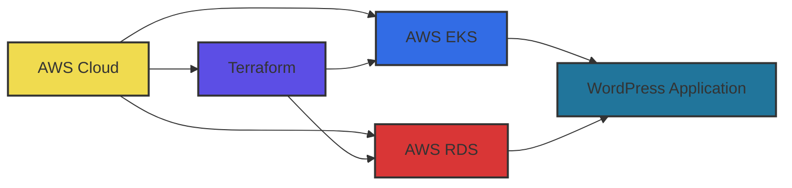
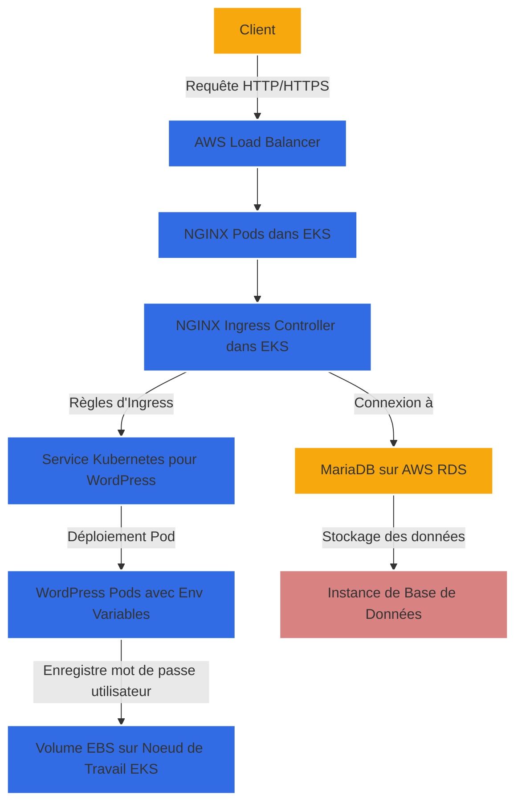

# Projet de Déploiement WordPress sur AWS avec Terraform et Kubernetes

## Introduction

Je suis un passionné de DevSecOps et de technologies cloud, et ce projet représente mon exploration dans le déploiement automatisé d'applications sur AWS en utilisant Terraform et Kubernetes. L'objectif est de déployer une instance WordPress de manière efficace, sécurisée et scalable.

## Architecture du Projet



L'architecture du projet repose sur plusieurs composants clés :

- **AWS EKS (Elastic Kubernetes Service)** pour gérer les conteneurs Kubernetes.
- **RDS (Relational Database Service)** pour la base de données MariaDB de WordPress.
- **S3 pour le backend Terraform** pour gérer l'état de Terraform.
- **Ingress Controller (Nginx)** pour router le trafic vers l'application WordPress.




## Configuration du Projet

### Fichiers Terraform

1. `backend.tf`: Configure S3 comme backend pour Terraform.
2. `eks.tf`: Définit le cluster EKS et le groupe de nœuds.
3. `provider.tf`: Configure le provider AWS.
4. `rds.tf`: Définit l'instance RDS pour WordPress.
5. `security_group.tf`: Configure les groupes de sécurité pour EKS et RDS.
6. `variables.tf` et `terraform.tfvars`: Définissent et initialisent les variables.

### Fichiers Kubernetes

1. `wordpress-deployment.yaml`: Déploie WordPress sur le cluster EKS.
2. `wordpress-ingress.yaml`: Configure l'Ingress pour exposer WordPress.


## Procédure de Déploiement

### Étape 1: Configuration de Terraform

```bash
terraform init
terraform plan
terraform apply
```

# Étape 2: Déploiement de WordPress sur EKS

```bash
kubectl apply -f wordpress-deployment.yaml
kubectl apply -f wordpress-ingress.yaml

```

### Étape 3: Configuration de l'Ingress Controller (Nginx)

#### Rôle de l'Ingress Controller

L'Ingress Controller dans Kubernetes joue un rôle crucial dans la gestion du trafic réseau vers les applications déployées dans le cluster. Dans notre cas, nous utilisons Nginx comme Ingress Controller. Nginx agit comme un reverse proxy, dirigeant le trafic entrant vers les services appropriés dans le cluster. Cela permet une gestion efficace du trafic et une meilleure performance des applications.

#### Sécurisation de l'Accès à l'Application

L'Ingress Controller contribue également à la sécurisation de l'accès à l'application. En utilisant des annotations spécifiques dans la configuration de l'Ingress, nous pouvons activer des fonctionnalités telles que la redirection SSL, l'authentification et d'autres politiques de sécurité. Cela garantit que l'accès à l'application WordPress est sécurisé et conforme aux meilleures pratiques de sécurité.

#### Configuration de l'Ingress

1. **Définir l'Ingress Resource**: Le fichier `wordpress-ingress.yaml` définit la ressource Ingress pour l'application WordPress. Il spécifie les règles pour router le trafic vers le service WordPress.

2. **Annotations Importantes**:
   - `kubernetes.io/ingress.class: "nginx"`: Spécifie que nous utilisons Nginx comme Ingress Controller.
   - `nginx.ingress.kubernetes.io/backend-protocol: "HTTP"`: Indique que le protocole de communication avec le backend est HTTP.
   - `nginx.ingress.kubernetes.io/ssl-redirect: "true"`: Force la redirection de HTTP vers HTTPS pour sécuriser les communications.
   - `nginx.ingress.kubernetes.io/use-regex: "true"`: Permet l'utilisation d'expressions régulières dans les règles de routage.

3. **Déploiement de l'Ingress Controller**:
   - Si ce n'est pas déjà fait, déployez Nginx Ingress Controller dans votre cluster EKS. Vous pouvez utiliser le fichier `nginx-ingress-controller.yaml` (non fourni ici, mais généralement disponible dans les dépôts officiels de Nginx ou Kubernetes).
   - Appliquez la configuration de l'Ingress en exécutant `kubectl apply -f wordpress-ingress.yaml`.

4. **Vérification**:
   - Après le déploiement, vérifiez l'état de l'Ingress en exécutant `kubectl get ingress`.
   - Assurez-vous que l'adresse IP ou le nom de domaine est correctement attribué et que les règles de routage sont correctement configurées.

#### Conclusion

La configuration de l'Ingress Controller est une étape essentielle pour assurer que le trafic est correctement dirigé vers votre application WordPress et que l'accès est sécurisé. En suivant ces étapes, vous garantissez une mise en œuvre efficace et sécurisée de l'Ingress dans votre architecture Kubernetes sur AWS.

# Sécurité et Maintenance

**Sécurité**: Assurez-vous que les groupes de sécurité sont correctement configurés pour limiter l'accès aux ressources.

**Maintenance**: Mettez régulièrement à jour les versions des services AWS et des images de conteneurs pour garantir la sécurité et les performances.

# Conclusion

Ce projet illustre comment Terraform et Kubernetes peuvent être utilisés ensemble pour déployer efficacement des applications sur AWS. Il démontre l'importance de la planification et de la configuration minutieuse pour assurer un déploiement réussi et sécurisé.


